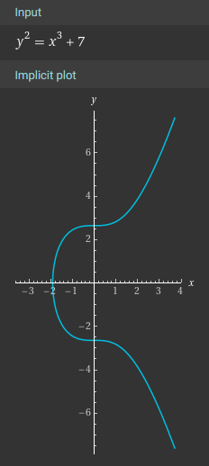

[](https://github.com/rickhull/schnorr_sig/actions/workflows/tests.yaml)

# Schnorr Signatures

This is a simple, minimal library written in Ruby for the purpose of
calculating and verifying so-called
[Schnorr signatures](https://en.wikipedia.org/wiki/Schnorr_signature),
based on elliptic curve cryptography.  This cryptographic method was
[patented by Claus P. Schnorr](https://patents.google.com/patent/US4995082)
in 1989 (expired 2010), and by 2021 it was adopted and popularized
by the [Bitcoin](https://en.wikipedia.org/wiki/Bitcoin) project.

This work is based on [BIP340](https://bips.xyz/340), one of the many
[Bitcoin Improvement Proposals](https://bips.xyz/), which are open documents
and specifications similar to
[IETF RFCs](https://en.wikipedia.org/wiki/Request_for_Comments).
BIP340 specifies elliptic curve `secp256k1` for use with Schnorr signatures.

Two separate implementations are provided.

## Ruby Implementation

This is the default implementation: entirely Ruby code within this library,
with mostly-Ruby dependencies:

* [ecdsa_ext](https://github.com/azuchi/ruby_ecdsa_ext)
  - [ecdsa](https://github.com/DavidEGrayson/ruby_ecdsa/)

## "Fast" Implementation

This is based on the [rbsecp256k1](https://github.com/etscrivner/rbsecp256k1)
gem, which is not installed by default.  The gem wraps the
[secp256k1](https://github.com/bitcoin-core/secp256k1) library from the
Bitcoin project, which provides battle-tested performance, correctness, and
security guarantees.

# Usage

This library is provided as a RubyGem.  It has a single dependency on
[ecdsa_ext](https://github.com/azuchi/ruby_ecdsa_ext), with a
corresponding transitive dependency on
[ecdsa](https://github.com/DavidEGrayson/ruby_ecdsa/).

## Install

Install locally:

```
$ gem install schnorr_sig
```

Or add to your project `Gemfile`:

```
gem 'schnorr_sig'
```

By default, only the dependencies for the Ruby implementation will be
installed: **ecdsa_ext** gem and its dependencies.

### Fast Implementation

After installing the **schnorr_sig** gem, then install
[rbsecp256k1](https://github.com/etscrivner/rbsecp256k1).
Here's how I did it on NixOS:

```
nix-shell -p secp256k1 autoconf automake libtool
gem install rbsecp256k1 -- --with-system-libraries
```

## Example

```ruby
require 'schnorr_sig'

msg = 'hello world'

# generate secret key and public key
sk, pk = SchnorrSig.keypair

# we can sign the message itself
sig = SchnorrSig.sign(sk, msg)

# the signature has already been verified, but let's check
SchnorrSig.verify?(pk, msg, sig)  # => true

# more commonly, you can sign a SHA256 hash of the message
h = Digest::SHA256.digest(msg)
sig = SchnorrSig.sign(sk, h)
SchnorrSig.verify?(pk, h, sig)    # => true

# you can even use SchnorrSig's concept of a tagged hash
h = SchnorrSig.tagged_hash('signing', msg)
sig = SchnorrSig.sign(sk, h)
SchnorrSig.verify?(pk, h, sig)    # => true

# validate that the hash corresponds to the message
# re-hash the message with the same tag
SchnorrSig.tagged_hash('signing', msg) == h  # => true
```

## Fundamentals

Here are the fundamental functions common to both implementations:

* `sign(32B sk, str msg)` *returns* `64B sig`
* `verify?(32B pk, str msg, 64B sig)` *returns* `bool`
* `pubkey(32B sk)` *returns* `32B pk`
* `tagged_hash(str tag, str msg)` *returns* `32B hash`
* `keypair()` *returns* `[32B sk, 32B pk]`

### Differences

* Fast: `sign(32B sk, 32B msg)`

The fast implementation only signs 32 byte payloads.  It expects to sign
a hash of the message and not the message itself.  The pure implementation
is happy to sign any payload.

* Pure: `sign(32B sk, str msg, auxrand: 32B)` *(auxrand is optional)*

The fast implementation always generates `auxrand` at signing time via
`SecureRandom`.  The pure implementation allows `auxrand` to be passed in,
but when omitted it will be generated by default by `SecureRandom`,
though `Random` may also be used via `NO_SECURERANDOM` environment variable.

## Enable Fast Implementation

*The `rbsecp256k1` gem must be installed,
otherwise there will be a `LoadError`.*

Ensure `ENV['SCHNORR_SIG']&.downcase == 'fast'`, and then
`require 'schnorr_sig'` will try the fast implementation first, before
falling back to the pure implementation.

After `require 'schnorr_sig'`, you can check which implementation is loaded
by the presence of `SchnorrSig::Pure` or `SchnorrSig::Fast`.

### Load Directly

```ruby
require 'schnorr_sig/fast'

include SchnorrSig

sk, pk = Fast.keypair
msg = 'hello world'
hsh = Fast.tagged_hash('message', msg)

sig = Fast.sign(sk, hsh)
Fast.verify?(pk, hsh, sig) # => true
```

### Side by Side

You can run each implementation side by side as follows:

```ruby
require 'schnorr_sig/pure'
require 'schnorr_sig/fast'

include SchnorrSig

sk, pk = Pure.keypair  # or Fast.keypair

msg = 'hello world'
hsh = Fast.tagged_hash('message', msg)

sig1 = Pure.sign(sk, hsh)
sig2 = Fast.sign(sk, hsh)

Fast.verify?(pk, hsh, sig1) # => true
Pure.verify?(pk, hsh, sig2) # => true
```

# Elliptic Curves

Note that [elliptic curves](https://en.wikipedia.org/wiki/Elliptic_curve)
are not ellipses, but are instead described by cubic equations of
the form: `y^2 = x^3 + ax + b` where `a` and `b` are the parameters of the
resulting equation.  All points `(x, y)` which satisfy a given parameterized
equation provide the exact definition of an elliptic curve.

## Curve `secp256k1`

`secp256k1` uses `a = 0` and `b = 7`, so `y^2 = x^3 + 7`



Here is one
[minimal definition of `secp256k1`](https://github.com/DavidEGrayson/ruby_ecdsa/blob/master/lib/ecdsa/group/secp256k1.rb):

```
{
  name: 'secp256k1',
  p: 0xFFFFFFFF_FFFFFFFF_FFFFFFFF_FFFFFFFF_FFFFFFFF_FFFFFFFF_FFFFFFFE_FFFFFC2F,
  a: 0,
  b: 7,
  g: [0x79BE667E_F9DCBBAC_55A06295_CE870B07_029BFCDB_2DCE28D9_59F2815B_16F81798,
      0x483ADA77_26A3C465_5DA4FBFC_0E1108A8_FD17B448_A6855419_9C47D08F_FB10D4B8],
  n: 0xFFFFFFFF_FFFFFFFF_FFFFFFFF_FFFFFFFE_BAAEDCE6_AF48A03B_BFD25E8C_D0364141,
  h: 1,
}
```

* `p` is the prime for the Field, below `INTMAX(32)` (256^32)
* `a` is zero, as above
* `b` is seven, as above
* `g` is the generator point: `[x, y]`
* `n` is the Group order, significantly below `INTMAX(32)`

Elliptic curves have algebraic structures called
[Groups](https://en.wikipedia.org/wiki/Group_\(mathematics\)) and
[Fields](https://en.wikipedia.org/wiki/Field_\(mathematics\)),
and prime numbers are useful.  I won't elaborate further here, as I am
still learning in this area and reluctant to publish misunderstandings.

## Generator Point

Every elliptic curve has an *infinity point*, and one step away from the
infinity point is a so-called *generator point*, `G`, a pair of large
integers, `(x, y)`.  Add `G` to the infinity point; the result is `G`.
Add `G` again, and the result is `2G`.  Where `N` is the *order* of the
curve, `NG` returns to the infinity point.

You can multiply `G` by any integer < `N` to get a corresponding point on
the curve, `(x, y)`. `G` can be compressed to just the x-value, as the
y-value can be derived from the x-value with a little bit of algebra:
`y = sign(x) * sqrt(x^3 + ax + b)`.

## Bignums

We can conjure into existence a gigantic *32-byte* integer. Until recently,
most consumer CPUs could only handle *32-bit* integers.  A 32-byte integer
is 8x larger than common hardware integers, so math on large integers must
be done in software.

In Ruby, you can get a 32-byte value with: `Random.bytes(32)`, which will
return a 32-byte binary string.  There are several ways to convert this to
an integer value, which in Ruby is called a **Bignum** when it exceeds
the highest value for a **Fixnum**, which corresponds to a hardware integer.

*Fixnums are fast; Bignums are slow*

## Keypairs

Let's conjure into existence a gigantic 32-byte integer, `sk` (secret key):

```
sk = Random.bytes(32) # a binary string, length 32
hex = [sk].pack('H*') # convert to a hex string like: "199ace9bc1 ..."
bignum = hex.to_i(16) # convert hex to integer, possibly a bignum
```

`sk` is now our 32-byte **secret key**, and `bignum` is the integer value
of `sk`.  We can multiply `bignum` by `G` to get a corresponding point on
the elliptic curve, `P`.

`P.x` is now our **public key**, the x-value of a point on
the curve.  Technically, we would want to convert the large integer `P.x`
to a binary string in order to make it a peer with `sk`.

```
group = ECDSA::Group::Secp256k1  # get a handle for secp256k1 curve
point = group.generator * bignum # generate a point corresponding to sk
pk = big2bin(point.x)            # public key: point.x as a binary string
```

The implementation of
[big2bin](https://github.com/rickhull/schnorr_sig/blob/master/lib/schnorr_sig/utils.rb#L26)
is left as an exercise for the reader.

## Formatting

* Binary String
* Integer
* Hexadecimal String

Our baseline format is the binary string:

```
'asdf'.encoding   # => #<Encoding:UTF-8>
'asdf'.b          # => "asdf"
'asdf'.b.encoding # => #<Encoding:ASCII-8BIT>
Encoding::BINARY  # => #<Encoding:ASCII-8BIT>
"\x00".encoding   # => #<Encoding:UTF-8>
"\xFF".encoding   # => #<Encoding:UTF-8>
```

Default encoding for Ruby's `String` is `UTF-8`.  This encoding can be used
for messages and tags in BIP340.  Call `String#b` to return
a new string with the same value, but with `BINARY` encoding.  Note that
Ruby still calls `BINARY` encoding `ASCII-8BIT`, but this may change, and
`BINARY` is preferred.  Anywhere you might say `ASCII-8BIT` you can say
`BINARY` instead.

Any `UTF-8` strings will never be converted to integers.  `UTF-8` strings tend
to be unrestricted or undeclared in size.  So let's turn to the `BINARY`
strings.

`BINARY` strings will tend to have a known, fixed size (almost certainly 32),
and they can be expected to be converted to integers, likely Bignums.

Hexadecimal strings (aka "hex") are like `"deadbeef0123456789abcdef00ff00ff"`.
These are never used internally, but they are typically used at the user
interface layer, as binary strings are not handled well by most user
interfaces.

Any Schnorr Signature implementation must be able to efficiently convert:

* binary to bignum
* bignum to binary
* binary to hex
* hex to binary

Note that "bignum to hex" can be handled transitively and is typically not
required.

## Takeaways

* For any given secret key (32 byte value), a public key is easily generated
* A public key is an x-value on the curve
* For any given x-value on the curve, the y-value is easily generated
* For most curves, there are two different y-values for an x-value
* We are always dealing with 32-byte integers: **Bignums**
* Bignum math can be expensive
* Converting between integer format and 32-byte strings can be expensive
* The Schnorr algorithm requires lots of `string <--> integer` conversion
* Hex strings are never used internally
* Provide efficient, obvious routines for the fundamental conversions

# Implementation

There are two independent implementations, the primary aiming for as
pure Ruby as is feasible while matching the BIP340 pseudocode,
with the secondary aiming for speed and correctness, relying on the
battle-tested [sep256k1 library](https://github.com/bitcoin-core/secp256k1)
provided by the Bitcoin project.

## Ruby Implementation

This is the default implementation and the only implementation for which
this gem specifies its dependencies:
the [ecdsa_ext](https://github.com/azuchi/ruby_ecdsa_ext) gem, which depends
on the [ecdsa](https://github.com/DavidEGrayson/ruby_ecdsa/) gem,
which implements the Elliptic Curve Digital Signature Algorithm (ECDSA)
almost entirely in pure Ruby.

**ecdsa_ext** provides computational efficiency for points on elliptic
curves by using projective (Jacobian) rather than affine coordinates.
Very little of the code in this library relies on these gems -- mainly
for elliptical curve computations and the `secp256k1` curve definition.

Most of the code in this implementaion is based directly on the pseudocode
from [BIP340](https://bips.xyz/340).  i.e. A top-to-bottom implementation
of most of the spec.  Enough to generate keypairs, signatures, and perform
signature verification.  Extra care was taken to make the Ruby code match
the pseudocode as close as feasible.  The pseudocode is commented
[inline](lib/schnorr_sig.rb#L58).

A lot of care was taken to keep conversions and checks to a minimum.  The
functions are very strict about what they accept and attempt to be as fast
as possible, while remaining expressive.  This implementation should
outperform [bip-schnorrb](https://github.com/chaintope/bip-schnorrrb)
in speed, simplicity, and expressiveness.

## Fast Implementation

This implementation depends on the
[rbsecp256k1](https://github.com/etscrivner/rbsecp256k1) gem, which is a
C extension that wraps the
[secp256k1](https://github.com/bitcoin-core/secp256k1) library, also known
as **libsecp256k1**.  There is much less code here, but the `SchnorrSig`
module functions perform some input checking and match the function
signatures from the Ruby implementation.  There are many advantages to
using this implementation over the Ruby implementation, aside from
efficiency, mostly having to with resistance to timing and side-channel
attacks.

The downside of using this implementation is a more difficult and involved
install process, along with a certain level of inscrutability.

### Temporary Restriction

Currently, **rbsecp256k1** restricts messages to exactly 32 bytes, which
was part of the BIPS340 spec until April 2023, when the restriction was lifted.

See https://github.com/etscrivner/rbsecp256k1/issues/80
